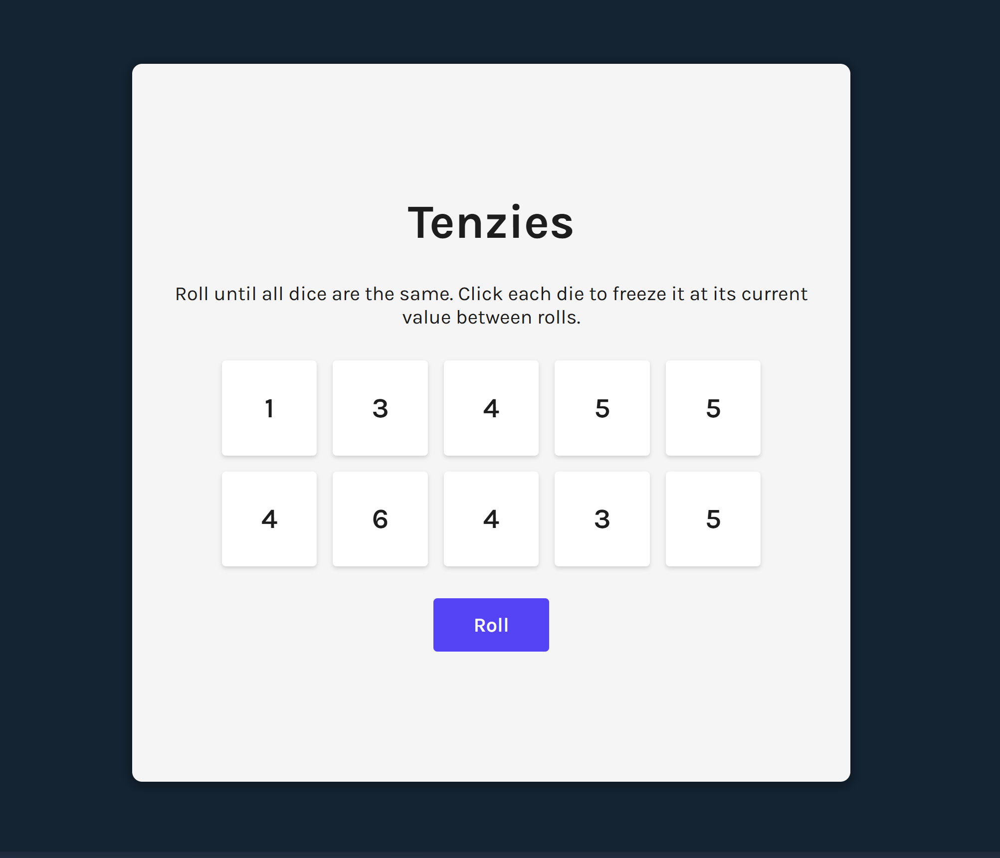

A simple game of Tenzies.

Link: [https://tenzies-hazel-seven.vercel.app/]

# Aim of the Game
Your goal is to have the same number on all your dice.

# How to play
1. You can click on dice to freeze them.
2. Click on Roll button to randomize the values on non-frozen dice.
3. Roll and freeze till you have frozen all dice with the same number 

### Learnings:
1. Using useState() and useEffect()
2. Derived state and why it is bad
3. every(), fill() methods on arrays
